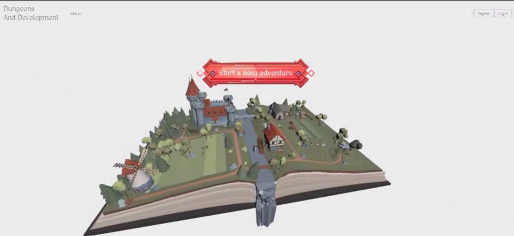
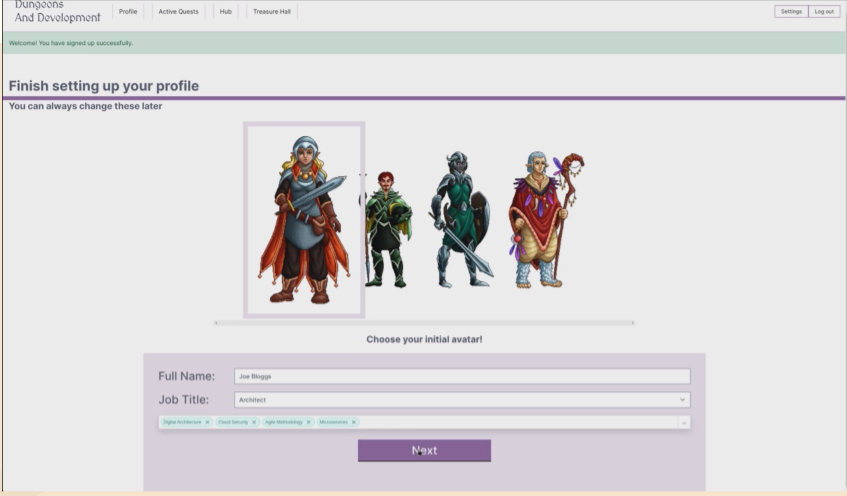
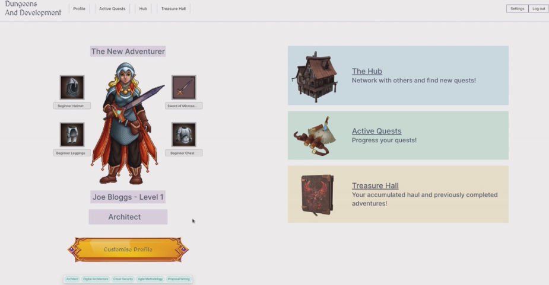
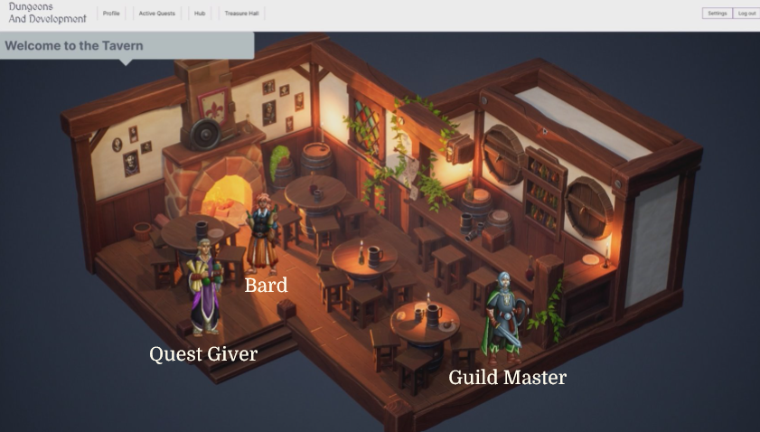
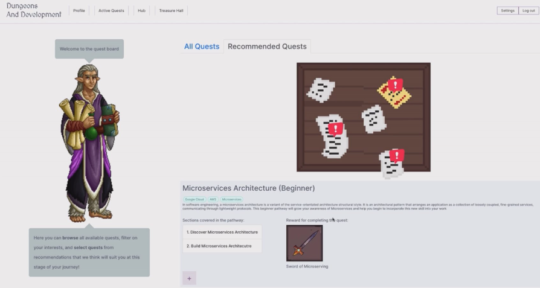
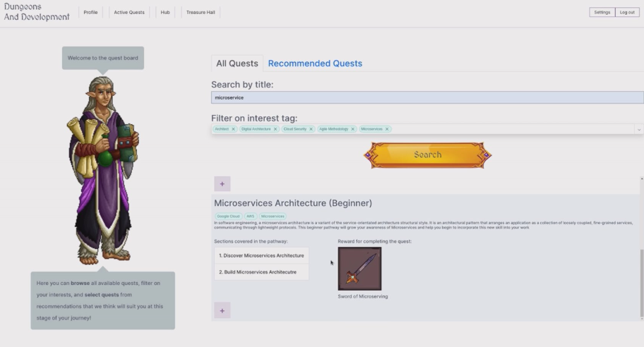
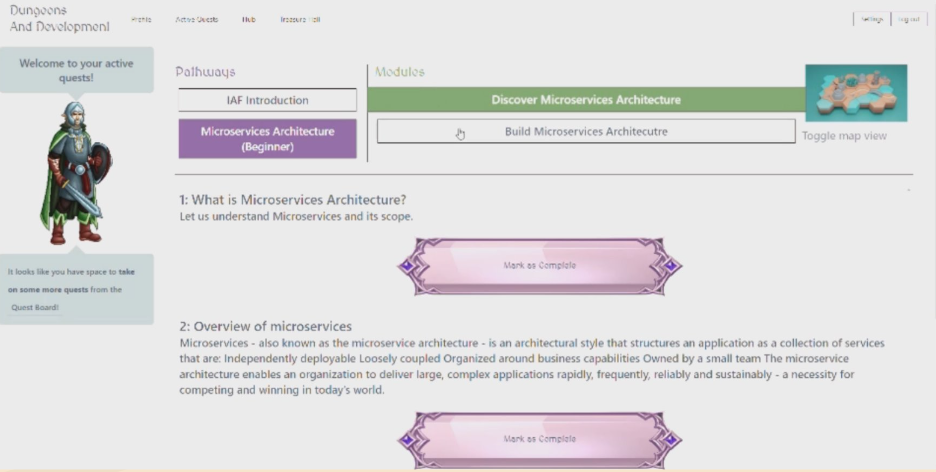
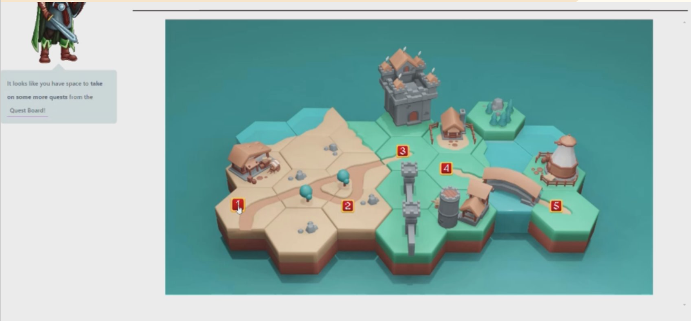

# Dungeons and Development

A unique gamification twist on personal development that incorporates fantasy themes and enables you to develop personally, and professionally, all whilst feeling like you're playing a game!

Embark on quests, customise your character, and experience fantasy visuals!

## The Idea and Goals

### Tracking

Focus on small achievable goals

### Digital First

With hybrid work, digital is necessary

### Consistency

Training every day

### Gamification

Sense of reward is more fun and motivating

### Personalisation

Be in control of customising your experience

### Novelty

New tools are engaging

### Progression

The more you play, the better you get

### Rewards

Small rewards keep us playing

### Challenge

Indications of difficulty help you pick new challenges

### Fun Visuals

Novelty of 2D/3D/Isometric graphics

### Sharing Success

Social games are more fun!

### Replayability

Great games make you keep coming back

## App Features

1. Embark on quests

   Tavern and quest board used to manage new quests and adventures

2. Customise your character

   Gain new equipment to show off your impressive achievements!

3. Fantasy visuals

   Boring lists replaced with interactive 3D fantasy maps to track progress and interact with the world.

## App Pages

### Homepage

### Character Creation

### Personal Profile

### Tavern

### Quest Board

### Quest Board - Search

### Quest Journal - List View

### Quest Journal - Map View

## Running the app

### Running locally

1. Clone down the project
2. run 'bundle install'
3. run '.\bin\rails server' in the project root directory
4. App will run on port 3000 at localhost:3000

### Running with Docker

The application is ready to run in a containerised environment with the use of docker.

#### Creating docker image

If you already have the container ready to run, skip to the 'Running the docker container' section

1. Navigate to the project's root directory ('/dungeons_and_development') in a terminal of your choice.
2. Run the folowing command to create the docker image `docker build --tag dungeons_and_development .`
3. Run the folowing command to list all available images `docker images`, and confirm that an image with the name 'dungeons_and_development' is present
4. Your image has been built!

#### Running the docker container

1. Navigate to the project's root directory ('/dungeons_and_development') in a terminal of your choice.
2. Run the folowing command to run the docker container using the compose file `docker compose up`
3. Wait for the container to spin up, this is indicated by the last two lines of the console looking similar to the below:
   dungeons_and_development-app-1 | \* Listening on http://0.0.0.0:3000
   dungeons_and_development-app-1 | Use Ctrl-C to stop
4. Navigate to http://0.0.0.0:3000 in your web browser
5. If you can see the landing page, you have succesfully run the containerised version of the application!

**Note:** If you have any issues spinning up the container, run the following command `docker compose down -v` before running `docker compose up`

## Technical Specs:

- Ruby version 3.2.2

- Rails version 7.1

- Database: PostgreSQL

- Threejs
